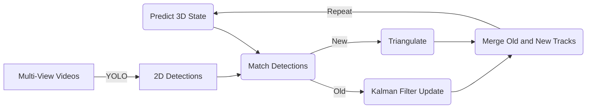
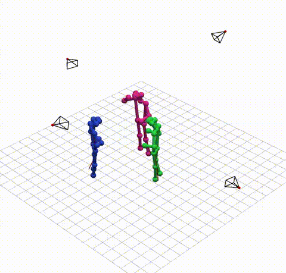

Markerless 3D Human Pose Tracking
=================================

## Key Project Deliverables

For evaluation purposes, the most important files are:

* **Source Code:** `code/` - Contains all the source code for the project, including code for environment setup and evaluation.
* **Project Report:** `report/main.pdf` - The comprehensive project report.
* **Final Presentation Slides:** `presentation1/main.pdf` - The slides for the final project presentation. Note that `presentation0/main.pdf` contains the slides for the progress day presentation.

## Project Overview

This project focuses on 3D Human Pose Estimation and Tracking in a Multi-Person and Multi-View setting. The primary goal is to explore the use of an Extended Kalman Filter based implementation that can accurately track 3D poses by fusing the 2D detections generated by a 2D Human Pose Estimation model. An overview diagram of the general system architecture is shown below:



For evaluation of the developed system, this project makes use of the [CMU Panoptic Dataset](http://domedb.perception.cs.cmu.edu/). The dataset consists of multiple sequences recorded from 511 angles together with ground truth human pose and tracking annotations. In this project only a subset of 8 sequences and up to 16 of the available camera views are used per sequence for evaluation. The scenes for evaluation have been chosen to be of diverse tasks and include also difficult instances.

> Joo, Hanbyul, et al. "Panoptic studio: A massively multiview system for social motion capture." Proceedings of the IEEE international conference on computer vision. 2015.

Below is an example of the results on one of the CMU Panoptic sequences that was generated using the smallest YOLO26 model (`YOLO26n-pose`) and only 4 camera views.



In addition to the CMU Panoptic dataset, for some qualitative analysis and demos also the [SALSA Dataset](https://tev.fbk.eu/resources/salsa) has been used. This dataset represents a much more difficult situation but since it does not contain any ground truth annotations for pose estimation, it could not be used for the quantitative evaluations.

> Alameda-Pineda, Xavier, et al. "Salsa: A novel dataset for multimodal group behavior analysis." IEEE transactions on pattern analysis and machine intelligence 38.8 (2015): 1707-1720.

### Project Structure

The project is organized into the following directories and key files:

```
.
├─code                           # Contains all the source code for the project.
│ ├─notebooks                    # Notebooks used for running different parts of the project.
│ │ ├─1.setup.ipynb              # Setup code for installing dependencies, downloading and generating datasets.
│ │ ├─2.a.train.kalman.ipynb     # Training code for the learned Kalman filter.
│ │ ├─2.b.train.yolo.ipynb       # Training code for the custom YOLO head.
│ │ ├─2.c.train.thresholds.ipynb # Code for tuning the thresholds.
│ │ ├─3.evaluation.ipynb         # Evaluation code using the test set.
│ │ └─4.demo.ipynb               # Code generating some demo recordings.
│ ├─calibrate.py                 # Calibration routines for calibrating camera setups.
│ ├─camera.py                    # Code for loading camera parameters, projection, and triangulation.
│ ├─dataset.py                   # Code for downloading and handling the datasets.
│ ├─demo.py                      # Code to run the system live.
│ ├─detect.py                    # Code for using the YOLO26-pose type models and training the custom head.
│ ├─kalman.py                    # Implementation of (extended) Kalman filter functionality.
│ ├─kflearn.py                   # Implementation of the Kalman filter learning and threshold tuning.
│ ├─source.py                    # Classes for handling video sources in the tracking system.
│ ├─tracker.py                   # This module contains the main entry point for the tracking system.
│ ├─util.py                      # Utility classes and functions, for exploration, training, and evaluation.
│ ├─visualize.py                 # Code to visualize the results of the tracking system in 3D.
│ ├─data/                        # This directory contains the datasets.
│ ├─nets/                        # Model weights for standard YOLO, custom models.
│ ├─scripts/                     # Some scripts for running the visualization and demo programs.
│ └─stats/                       # Evaluation results.
├─presentation0/                 # Progress day presentation slides (LaTeX).
├─presentation1/                 # Final project presentation slides (LaTeX).
├─report/                        # Full project report (LaTeX).
├─requirements.txt               # List of required Python dependencies to run the Project.
└─README.md                      # This file.
```

## Setup, Installation, Usage

Before starting, you should download the repository locally by running the following commands:

```bash
git clone https://github.com/rolandbernard/capstone-project
cd capstone-project
```

### Setup

To set up and run this project, follow these steps after downloading the project:

1.  **Create a virtual environment (recommended):**
    ```bash
    python -m venv venv
    source venv/bin/activate  # On Windows, use `venv\Scripts\activate`
    ```
2.  **Install dependencies:**
    The project relies on a set of Python libraries. Install them using `pip`:
    ```bash
    pip install -r requirements.txt
    ```
    *Note: The `requirements.txt` includes specific versions for reproducibility. Ensure your environment is compatible or remove the versions.*

    Alternatively, run the following, which is also the first code cell in `1.setup.ipynb`:
    ```bash
    pip install numpy pandas scipy pillow opencv-python opencv-contrib-python torch torchvision ultralytics==8.4.51 matplotlib seaborn pyvista[jupyter] jupyter ipywidgets gdown einops tabulate kornia networkx
    ```
    *Note: The `ultralytics` versions is specified exactly because the latest version of the libraries contains changes incompatible with the custom trained YOLO head without code modifications.*
3. **Download the Dataset:**
    To download the datasets, and install missing dependencies (if not done in the previous step), simply run the corresponding cells in the `1.setup.ipynb` notebook. It will automatically download the datasets and extract it into the `code/data` directory. It also contains code for generating the datasets used for training the custom YOLO head and the Kalman parameters.

### Usage

The project is divided into multiple Python files found in the `code/` directory.
* `tracker.py` contains the main entry point for the implemented tracking system. You may look at `Tracker.evaluate()` for how to use it.
* `visualize.py` contains code to visualize results. In addition to use as a module, this file can also be executed using `python code/visualize.py FILENAME [--gt-path GT_FILENAME]` where `FILENAME` and `GT_FILENAME` refer to the files generated by the evaluation for the prediction and ground truth respectively. You may also look at `code/scripts/show-eval.sh` for an example use.
* `demo.py` contains code to run the system live, either from webcam or from files. The file can be executed using `python code/visualize.py ...SOURCES [--cams ...CALIB_FILES]` where `SOURCES` and `CALIB_FILES` refer to video sources (either video filenames, webcam device IDs, or IP camera URLs) and the camera calibration files. You may also look at `code/scripts/run-live.sh` for an example use.

The `code/notebooks` directory also contains the following two Jupyter notebooks:
* For initial setup of dependencies and to download and generation the datasets, take a look at `1.setup.ipynb`.
* `3.evaluation.ipynb` includes the code for running evaluation using the test sequences from the dataset.

In case you want to inspect or modify the tracking algorithm, `tracker.py` contains the main entry point, with the Kalman filter components in `kalman.py` and the detection parts in `detect.py`. Note that the implementation can be configured in different ways, e.g., changing the physics model or the detection network.
